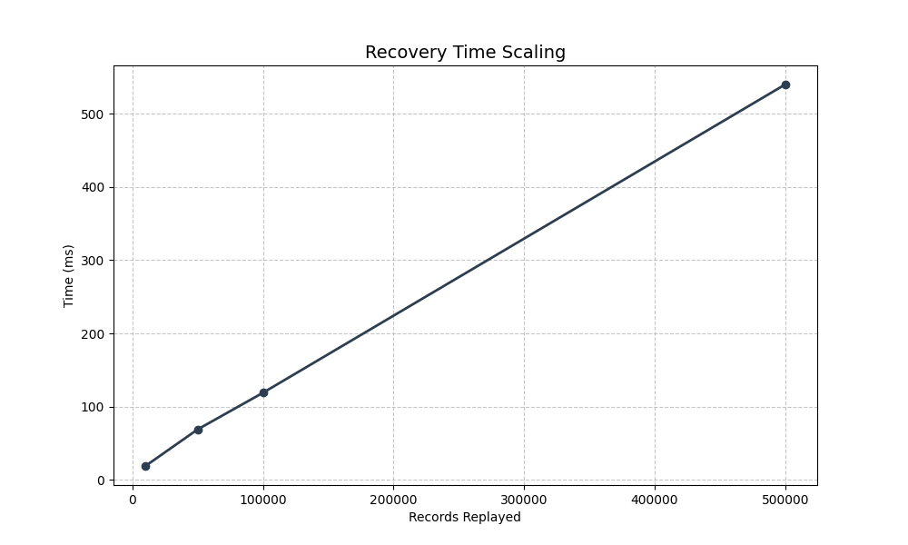
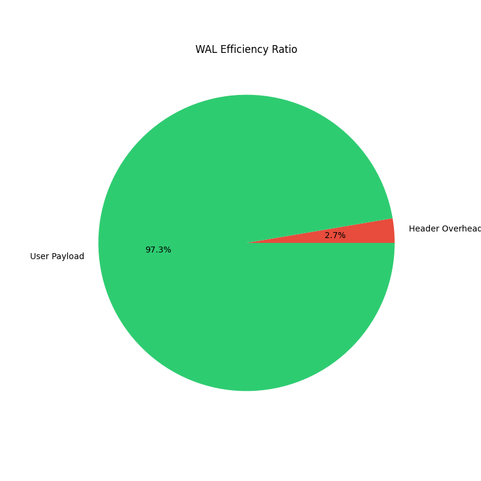

# 💎 RocksDB WAL: Engineering Analysis & Instrumentation

[-orange?style=for-the-badge&logo=github)](https://github.com/srishti7103/rocksdb-WAL/compare/main...wal-experiments)

This project reverse-engineers and instruments the **RocksDB Write-Ahead Log (WAL)** to analyze the fundamental tradeoffs between data persistence guarantees and write throughput. Developed as a final project for **DS614 Systems Engineering**.

---

## 📑 Quick Access: Core Instrumentation
Explore the surgically modified files featuring atomic telemetry for performance tracking:

| Component | File Link | Instrumentation Focus |
| :--- | :--- | :--- |
| **Write Path** | [`db_impl_write.cc`](./db/db_impl/db_impl_write.cc) | Sync-mode telemetry (Strict vs. Buffered) |
| **Log Writer** | [`log_writer.cc`](./db/log_writer.cc) | Fragmentation & Header Overhead tracking |
| **Batching** | [`write_thread.cc`](./db/write_thread.cc) | Group Commit efficiency metrics |
| **Recovery** | [`db_impl_open.cc`](./db/db_impl/db_impl_open.cc) | Startup MTTR & Replay telemetry |
| **Checksums** | [`log_reader.cc`](./db/log_reader.cc) | Corruption detection & CRC mismatch counters |

---

## 🛠 What is Being Changed?
We have injected `std::atomic` counters into the core I/O path to capture high-resolution metrics without degrading system performance:
*   **Safety Tax Tracking**: Distinguishing between `fsync()`-heavy synchronous writes and OS-buffered writes.
*   **Record Integrity**: Monitoring record fragmentation when user payloads exceed the configurable `ROCKSDB_WAL_BLOCK_SIZE`.
*   **Batching Efficiency**: Measuring the average "Group Size" during high-concurrency write operations.

---

## 🚀 How to Run (WSL / Ubuntu)

### 1. Prerequisites
Ensure your Linux environment has the standard RocksDB build dependencies:
```bash
sudo apt-get update
sudo apt-get install build-essential libsnappy-dev zlib1g-dev libbz2-dev liblz4-dev libzstd-dev
```

### 2. Build the Library
Compile the instrumented RocksDB static library:
```bash
make static_lib -j$(nproc)
```

### 3. Run the Benchmark Suite
The project includes a dedicated `experiments/` folder with standalone drivers for all 5 studies:
```bash
cd experiments
make
./sync_bench      # Study 1
./fragment_bench  # Study 2
./recovery_bench  # Study 3
./batch_bench     # Study 4
./skew_bench      # Study 5
```

---

## 📊 Experimental Results
The following charts represent the telemetry gathered through our custom instrumentation. For a full analysis, refer to the **[Engineering Report](./report.md)**.

### Study 1: The "Safety Tax" (Throughput)


### Study 2: Fragmentation & Header Overhead


### Study 5: Recovery Scaling (MTTR)


> [!NOTE]
> *For detailed technical deep-dives into Studies 3 and 4, please see sections 3.3 and 3.4 of the Engineering Report.*

---

## 👥 Credits
*   **Team**: Sigma & Spark
*   **Lead Engineer**: Srishti
*   **Contributors**: [Member Name 1], [Member Name 2]
*   **Institution**: DS614 - Systems Engineering

---
*This fork is maintained for academic research into persistent storage engine architectures.*
