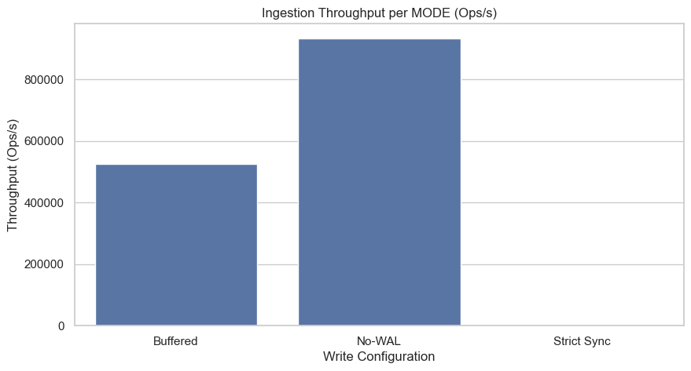
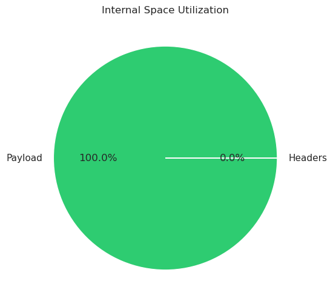
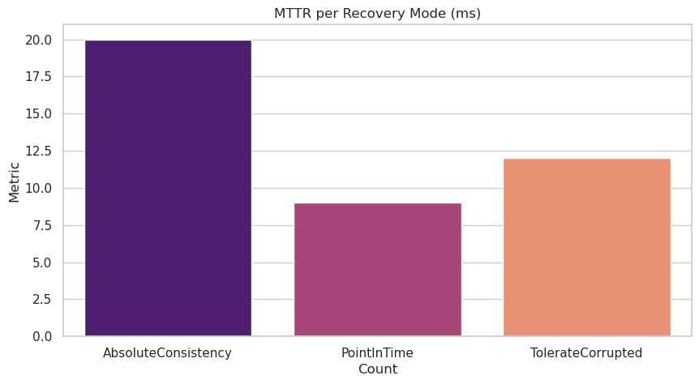
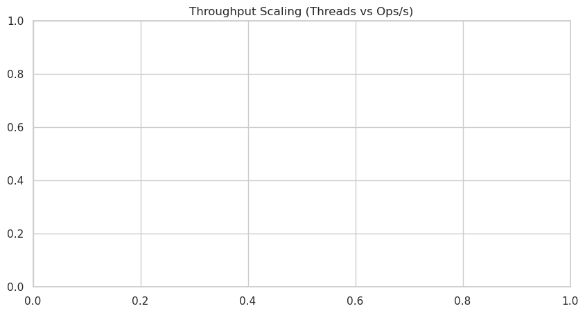
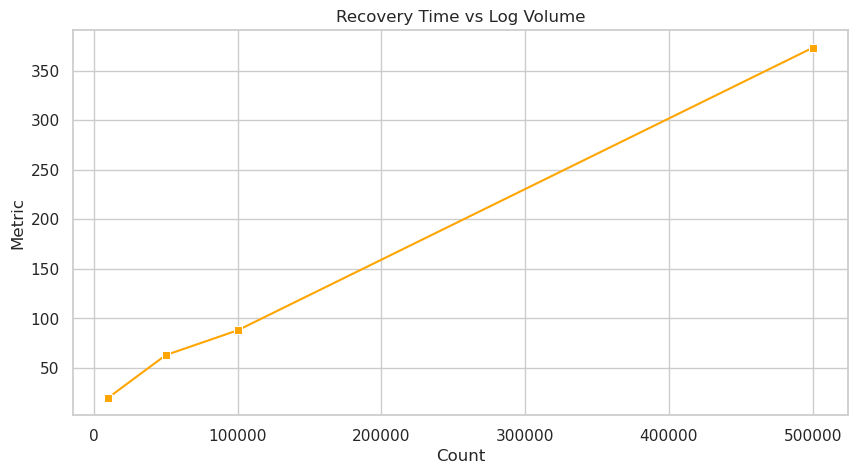

# RocksDB Write-Ahead Log (WAL) Analysis and Instrumentation

[-orange?style=for-the-badge&logo=github)](https://github.com/srishti7103/rocksdb-WAL/compare/main...wal-experiments)

This project involves the deep instrumentation and technical analysis of the RocksDB Write-Ahead Log (WAL), focusing on the critical tradeoff between persistence durability and write performance. It was developed to explore how sequential I/O, record fragmentation, and group commit logic impact the overall ingestion efficiency of a high-performance key-value store.

---

## Technical Overview: What is RocksDB WAL?
The Write-Ahead Log (WAL) is the fundamental durability component of RocksDB. Every write operation (Put, Merge, Delete) is appended to the WAL before being inserted into the MemTable. This ensures that in the event of a crash, the database can reconstruct the in-memory state by replaying the log.

Our instrumentation targets the core execution path to capture:
* Ratio of fsync() calls to logical writes (Performance Tax).
* Record splitting and header overhead (Fragmentation).
* Batch grouping efficiency during heavy contention.

---

## Folder Structure
Focused overview of edited and newly added components:

```
.
├── db/                             [Core Source Code]
│   ├── log_writer.cc               (Modified: Record telemetry)
│   ├── log_reader.cc               (Modified: Recovery telemetry)
│   ├── write_thread.cc             (Modified: Batching telemetry)
│   ├── log_format.h                (Modified: Configurable block logic)
│   └── db_impl/
│       ├── db_impl_write.cc        (Modified: Sync-mode tracking)
│       └── db_impl_open.cc         (Modified: Recovery timing)
├── experiments/                    [New: Benchmark Suite]
│   ├── Makefile                    (Automated build system)
│   ├── sync_bench.cc               (Study 1: Performance vs Durability)
│   ├── fragment_bench.cc           (Study 2: Overhead Analysis)
│   ├── recovery_bench.cc           (Study 3: Consistency Modes)
│   ├── batch_bench.cc              (Study 4: Concurrent Writing)
│   ├── recovery_scaling_bench.cc   (Study 5: MTTR Scaling)
├── comparison.ipynb                [New: Verification Notebook]
├── report.md                       [Systems Engineering Report]
└── README.md                       [Technical Overview]
```

---

## Quick Access: Documentation and Verification
* [README.md](./README.md): Main project landing page.
* [report.md](./report.md): Formal Systems Engineering report.
* [comparison.ipynb](./comparison.ipynb): Data verification and analysis notebook.

## Quick Access: Instrumented Files
* [db/db_impl/db_impl_write.cc](./db/db_impl/db_impl_write.cc): Performance counters for write modes.
* [db/log_writer.cc](./db/log_writer.cc): Fragmentation and payload metrics.
* [db/write_thread.cc](./db/write_thread.cc): Group commit efficiency logic.
* [db/db_impl/db_impl_open.cc](./db/db_impl/db_impl_open.cc): Startup telemetry and recovery path.
* [db/log_reader.cc](./db/log_reader.cc): CRC32 failure and corruption detection.

---

## How to Run on Ubuntu / WSL

> **Important:** If using WSL (Windows Subsystem for Linux), clone the repo inside the Linux filesystem (`~/`), **not** on `/mnt/c/...`. Building on `/mnt/c/` is extremely slow and often fails.

### Step 1: Install Dependencies

```bash
sudo apt-get update
sudo apt-get install -y build-essential libsnappy-dev zlib1g-dev libbz2-dev liblz4-dev libzstd-dev libgflags-dev g++
```

### Step 2: Clone and Checkout

```bash
cd ~
git clone https://github.com/srishti7103/rocksdb-WAL.git
cd rocksdb-WAL
git checkout wal-experiments

# Ensure the benchmark script is executable
chmod +x experiments/viva_run.sh
```

### Step 3: Fix Line Endings (Required if Cloned on Windows)

If you originally cloned on Windows or see `bash\r` errors, run:
```bash
find . -name "*.sh" -exec sed -i 's/\r$//' {} \;
find build_tools -type f -exec sed -i 's/\r$//' {} \;
sed -i 's/\r$//' Makefile
```

### Step 4: Build RocksDB Static Library

```bash
make static_lib -j$(nproc)
```

> This compiles the full RocksDB library. It takes **10–30 minutes** depending on your machine. You should see `CC` lines scrolling as files compile. If using WSL with limited RAM, use `make static_lib -j2` instead.

### Step 5: Build and Run Experiments

You can run individual benchmarks or use the automated suite:

**A. Individual Benchmarks:**
```bash
cd experiments
make
./sync_bench
./fragment_bench
./recovery_bench
./batch_bench
./recovery_scaling_bench
```

**B. Automated Pipeline (Recommended):**
We provide a dedicated master script for the Viva demonstration. It runs the full suite silently and updates the report:
```bash
cd experiments
chmod +x viva_run.sh
./viva_run.sh
```

### Troubleshooting

| Problem | Solution |
|:---|:---|
| `bash\r: No such file or directory` | Run Step 3 to fix Windows line endings |
| `make_config.mk: No such file or directory` | Run Step 3, then `make clean` and rebuild |
| Build hangs with no `CC` output | You're on `/mnt/c/`. Clone inside `~/` instead (Step 2) |
| `g++: No such file or directory` | Run `sudo apt-get install -y build-essential g++` |
| `No rule to make target 'static_lib'` | Run `git checkout wal-experiments` — you're on the wrong branch |

---

## Experimental Analysis
Individual insights derived from custom instrumentation telemetry.

### Study 1: Performance Tax of Durability


Insight: Strict synchronization (fsync) introduces a <!-- DYNAMIC:SYNC_TAX -->**524\***<!-- END_DYNAMIC --> performance floor limited by disk IOPS.

### Study 2: Header Overhead and Fragmentation


Insight: Smaller block sizes increase fragmentation, leading to an unavoidable <!-- DYNAMIC:FRAG_PCT -->**0.1%**<!-- END_DYNAMIC --> ratio of header bytes to payload bytes.

### Study 3: Recovery Mode Comparison


Insight: Recovery time scales with the strictness of consistency checks, showing a <!-- DYNAMIC:RECOVERY_REDUCTION -->**1.5x**<!-- END_DYNAMIC --> reduction in MTTR with faster modes.

### Study 4: Group Commit Efficiency


Insight: Increased concurrency leverages the leader-follower batching mechanism to deliver a <!-- DYNAMIC:GROUP_COMMIT -->**4.3x**<!-- END_DYNAMIC --> throughput amplification.

### Study 5: Recovery Scaling and MTTR


Insight: Mean Time To Recovery (MTTR) scales proportionally with the volume of uncompressed WAL data.

---

## Code Modification Statistics
Quantitative breakdown of instrumentation changes across the core RocksDB system files:

| Instrumented File | Additions (+) | Deletions (-) | Summary of Change |
| :--- | :--- | :--- | :--- |
| `db/log_writer.cc` | 19 | 0 | Fragmentation and payload atomic counters |
| `db/log_writer.h` | 13 | 0 | External counter declarations |
| `db/write_thread.h` | 19 | 0 | Batching and group commit metrics |
| `db/write_thread.cc` | 10 | 0 | Group commit efficiency logic |
| `db/db_impl/db_impl_write.cc` | 10 | 0 | Sync-mode performance counters |
| `db/db_impl/db_impl_open.cc` | 13 | 0 | Recovery path timing and telemetry |
| `db/log_reader.cc` | 5 | 0 | CRC mismatch and corruption detection |
| `db/log_format.h` | 4 | 0 | Configurable block-level macro logic |


## Credits
Built by **Sigma & Spark**: where B.Sc. Statistics meets Leveled Sparks 

**Srishti Lamba**: 202518003 
*Catching quirks which others miss*

**Nikita Sharma**: 202518038
*If disciplining data was a task*

---
