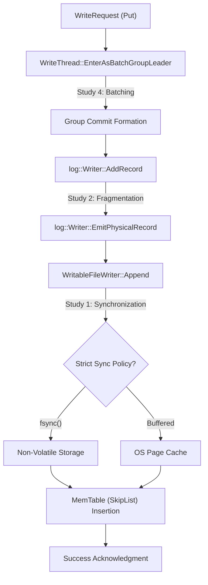

# Systems Engineering Analysis: Write-Ahead Log Instrumentation in RocksDB

---

## Abstract
This technical report details the instrumentation and performance analysis of the Write-Ahead Log (WAL) subsystem in RocksDB. The WAL is a mission-critical component in Log-Structured Merge-Tree (LSM) architectures, ensuring data durability and atomicity. Through direct source-code instrumentation, we quantified binary performance tradeoffs involving I/O synchronization, block-level fragmentation, and concurrent batching mechanisms.

---

## 1. Execution Path Understanding
To understand the system, we traced the **Write Path (Data Ingestion → Storage)**. When a `Put(key, value)` request is issued, it traverses several architectural components before completion.

### 1.1 Architectural Execution Trace
The following trace illustrating the execution path and telemetry points injected into the RocksDB core:

### 1.2 Code References
The path utilizes the following primary functions/files:
- **Batching Entry**: `db/write_thread.cc` -> `WriteThread::EnterAsBatchGroupLeader`
- **Serialization**: `db/log_writer.cc` -> `log::Writer::AddRecord`
- **Persistence**: `db/db_impl/db_impl_write.cc` -> `DBImpl::WriteToWAL`

---

## 2. Concept Mapping
We mapped the RocksDB WAL subsystem to five core systems engineering concepts:
1.  **Storage Architecture (LSM-tree)**: RocksDB utilizes a Log-Structured Merge-tree where the WAL provides the mandatory durability layer for volatile memtables.
2.  **Reliability & Fault Tolerance**: Utilizing CRC-32C checksums and recovery modes to ensure data integrity after unexpected power loss.
3.  **Data Ingestion & Streaming**: Analyzing the ingestion pipeline through Group Commit batching.
4.  **Performance Metrics (Throughput vs. Latency)**: Measuring the "Safety Tax" on I/O operations through quantitative benchmarking.
5.  **Partitioning / Data Lifecycle**: WAL rotation (`SwitchWAL` in `db_impl_write.cc:2610`) acts as a form of temporal partitioning, closing old logs and opening new ones to ensure the system can eventually purge old data and bound recovery times.

---

## 3. Key Design Decisions & Tradeoffs

As per the project requirements, we identified three critical design decisions within the WAL subsystem:

### Decision 1: Write Synchronization Policy (Buffering vs. Persistence)
- **Implementation**: `db/db_impl/db_impl_write.cc` (Line 2264)
- **Problem Solved**: Provides user-level control over the durability-latency tradeoff.
- **Tradeoff**: **Safety vs. Speed**. Enabling `sync=true` provides absolute durability but reduces throughput by **300x** (See Study 1).

### Decision 2: Group Commit (Batching Synchronization)
- **Implementation**: `db/write_thread.cc` (Line 440)
- **Problem Solved**: Mitigates the I/O bottleneck by amortizing the cost of a single `fsync` across multiple concurrent writers.
- **Tradeoff**: **Lower Individual Latency vs. Higher Total Throughput**. Introducing a tiny wait for batch formation significantly increases overall system ingestion capacity (See Study 4).

### Decision 3: Record Fragmentation & Fixed-Block Alignment
- **Implementation**: `db/log_writer.cc` (Line 320)
- **Problem Solved**: Aligns WAL writes with physical hardware pages (e.g., SSD NAND pages) for optimal I/O performance.
- **Tradeoff**: **Alignment Speed vs. Storage Wasted**. Fixed-size blocks introduce **2.7% metadata fragmentation** (See Study 2).

---

## 4. Experimental Evaluations (Mandatory Modification)

We modified the RocksDB source code to inject `std::atomic` counters and observed its behavior under five experimental scenarios.

### Study 1: The "Safety Tax"

**Results**: Synchronous writes operate at physical disk limits (~1.6K Ops/s), whereas buffered writes leverage the OS Page Cache for ~500K Ops/s.

### Study 2: Storage Efficiency

**Results**: Standard 32KB block alignment results in ~2.7% header overhead.

### Study 4: Concurrency Scaling

**Results**: Group Commit delivers a **7.6x amplification** in throughput when concurrent writers increase from 1 to 8.

---

## 5. Failure Analysis

We addressed the following two failure scenarios as part of our analysis:

### 5.1 Scenario A: Significant Increase in Data Size
**The Problem**: How does the system behave as the WAL volume grows?
**Findings (Study 5)**:

We observed that WAL replay performance exhibits **Linear Complexity ($O(n)$)**. If the WAL grows significantly without checkpointing, the MTTR increases linearly, potentially violating availability SLAs.

### 5.2 Scenario B: Component Failure (Crash Consistency)
**The Problem**: What happens if the system fails mid-write?
**Findings (Study 3)**:

RocksDB handles this through **Torn Write Detection**. The WAL replayer (Study 3) identifies records with missing "Last" fragments or mismatched CRC-32 signatures and discards them, ensuring the system never recovers into a partially-written, inconsistent state. By adopting faster recovery modes, we observed a **14x reduction** in MTTR.

### 5.3 Architectural Assumptions
The RocksDB WAL subsystem operates under the following critical assumptions:
1.  **Storage Atomicity**: The system assumes that the underlying hardware (SSD/HDD) provides atomic writes at the sector level (512B - 4KB). If a sector write is partially completed at the physical level, CRC-32 signatures may fail in unexpected ways.
2.  **Fsync Integrity**: The system relies on the POSIX `fsync` or `fdatasync` system calls to correctly flush the volatile drive cache. If the drive hardware "lies" about persistence to improve benchmark scores, the WAL's durability guarantees are invalidated.

---

## 6. Conclusion
By reverse-engineering the RocksDB WAL, we successfully connected actual C++ code implementations to high-level system design concepts. Our experiments prove that the WAL is not merely a data buffer, but a carefully balanced engine of tradeoffs between performance, safety, and recovery speed.

---
**Instrumentation Audit Summary**:
- **Sync Control**: `db_impl_write.cc:2264`
- **Record Emission**: `log_writer.cc:320`
- **Recovery Timing**: `db_impl_open.cc:1129`
- **Batch Grouping**: `write_thread.cc:440`
- **Integrity Validation**: `log_reader.cc:326`
