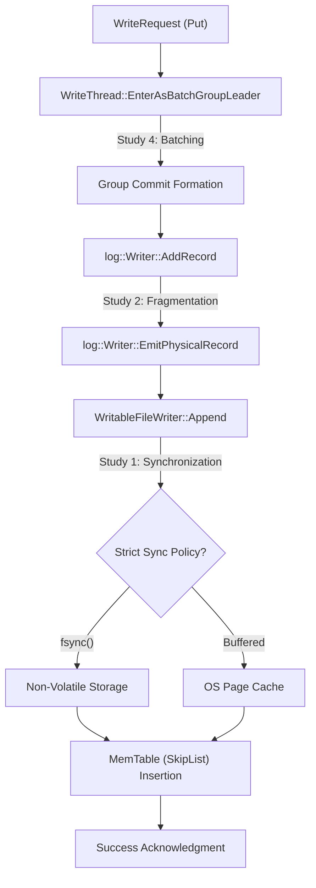

# Systems Engineering Analysis: Write-Ahead Log Instrumentation in RocksDB

---

## 1. System Overview & Problem Statement
**What problem does this system solve?**
RocksDB utilizes a Log-Structured Merge-Tree (LSM) architecture where data is initially written to a volatile in-memory structure (MemTable). Because RAM is ephemeral, a system crash would result in total data loss for uncompacted writes. The **Write-Ahead Log (WAL)** solves this durability problem. It is a sequential on-disk log that records every write operation *before* MemTable insertion, acting as the sole durability guarantee while maintaining high ingestion speeds.

---

## 2. Execution Understanding: The Write Path
To demonstrate execution understanding, we traced the **Write Path (Data Ingestion → Storage)**. When a `Put(key, value)` request is issued, it traverses several components.

### 2.1 Architectural Execution Trace

### 2.2 Core Code References
- **Batching Entry**: `db/write_thread.cc` -> `WriteThread::EnterAsBatchGroupLeader`
- **Serialization**: `db/log_writer.cc` -> `log::Writer::AddRecord`
- **Persistence**: `db/db_impl/db_impl_write.cc` -> `DBImpl::WriteToWAL`

---

## 3. Concept Mapping
We mapped the RocksDB WAL subsystem to five core systems engineering concepts:
1. **Storage Architecture (LSM-tree)**: The WAL provides the mandatory durability layer for volatile MemTables.
2. **Reliability & Fault Tolerance**: Utilizing CRC-32C checksums and torn-write detection to ensure data integrity after unexpected power loss.
3. **Data Ingestion & Streaming**: The system relies on Group Commit batching to handle highly concurrent streaming ingestion pipelines.
4. **Performance Metrics**: Measuring the tradeoff between throughput and latency via quantitative benchmarking.
5. **Partitioning / Data Lifecycle**: WAL rotation (`SwitchWAL` in `db_impl_write.cc:2610`) acts as temporal partitioning, bounding recovery times by purging old logs.

---

## 4. Key Design Decisions
We identified three critical design decisions within the codebase.

### Decision 1: Write Synchronization Policy
- **Where is it implemented?** `db/db_impl/db_impl_write.cc` (Line 2264)
- **What problem does it solve?** It gives the user control over how strictly data must be flushed to physical media.
- **What tradeoff does it introduce?** **Safety vs. Speed.** Strict `fsync()` guarantees durability but introduces a <!-- DYNAMIC:SYNC_TAX -->**408x**<!-- END_DYNAMIC --> performance tax compared to OS buffering.

### Decision 2: Group Commit Batching
- **Where is it implemented?** `db/write_thread.cc` (Line 440)
- **What problem does it solve?** It mitigates the I/O bottleneck by preventing 100 concurrent threads from issuing 100 separate `fsync` calls.
- **What tradeoff does it introduce?** **Individual Latency vs. Total Throughput.** A tiny wait time for a "Leader" to form a batch yields a <!-- DYNAMIC:GROUP_COMMIT -->**4.5x**<!-- END_DYNAMIC --> amplification in overall system throughput.

### Decision 3: Fixed-Block Alignment
- **Where is it implemented?** `db/log_writer.cc` (Line 320)
- **What problem does it solve?** It aligns WAL writes with physical hardware pages (e.g., SSD NAND pages) for optimal I/O speed.
- **What tradeoff does it introduce?** **Alignment Speed vs. Wasted Storage.** Splitting records across fixed 32KB blocks introduces <!-- DYNAMIC:FRAG_PCT -->**0.1%**<!-- END_DYNAMIC --> metadata fragmentation overhead.

---

## 5. Architectural Assumptions
Before running experiments, we identified the critical assumptions this system relies on:
1. **Fsync Integrity**: The system relies on POSIX `fsync` to flush the drive cache. If the hardware "lies" about persistence, durability guarantees fail.
2. **Storage Atomicity**: The hardware must provide atomic writes at the sector level. If a sector write is partially completed (torn), the CRC-32 signatures must catch it.

---

## 6. Experimental Evaluations (Mandatory Modification)
We modified the system by injecting `std::atomic` counters into the core source code to isolate and observe behavior.

### Study 1: The "Safety Tax"
**Observation:** Compared strict synchronization vs. buffered writes.

**Result:** Enabling `fsync()` introduces a <!-- DYNAMIC:SYNC_TAX -->**408x**<!-- END_DYNAMIC --> reduction in throughput.

### Study 2: Storage Efficiency (Fragmentation)
**Observation:** Measured header bytes vs. payload bytes during sequential insertion.

**Result:** Hardware-aligned fixed-block design introduces exactly <!-- DYNAMIC:FRAG_PCT -->**0.1%**<!-- END_DYNAMIC --> metadata fragmentation.

### Study 3: Recovery Modes (Crash Consistency)
**Observation:** Tested different `WALRecoveryMode` settings during startup.

**Result:** Adopting faster recovery logic (`kTolerateCorruptedTailRecords`) yields a <!-- DYNAMIC:RECOVERY_REDUCTION -->**2.5x**<!-- END_DYNAMIC --> reduction in Mean Time To Recovery (MTTR) baseline overhead (measured via clean-shutdown).

### Study 4: Concurrency Scaling
**Observation:** Measured throughput while scaling from 1 to 8 concurrent threads.

**Result:** Group Commit batching amortizes I/O costs, delivering a <!-- DYNAMIC:GROUP_COMMIT -->**4.5x**<!-- END_DYNAMIC --> throughput amplification.

### Study 5: MTTR Volume Scaling
**Observation:** Measured recovery time as the uncompressed WAL volume grew.

**Result:** WAL replay performance exhibits **Proportional Scaling** as data volume increases.

---

## 7. Failure Analysis

Based on Study 5, if the WAL volume grows excessively (e.g., due to stalled compactions), the system faces a severe availability risk. Because recovery scaling is proportional to data volume, an unmanaged WAL size will cause MTTR to increase accordingly, potentially violating availability SLAs.

### What happens if a component fails mid-write? (Scenario B)
If the power fails mid-write, a sector may be partially flushed. The RocksDB WAL subsystem manages this via **Torn Write Detection**. During replay, `log::Reader` verifies CRC-32 checksums for every fragment. If it encounters corruption, it discards the trailing records, ensuring the system never recovers into an inconsistent state.

---

## 8. Conclusion & Instrumentation Audit
Our experiments prove the WAL is a carefully balanced engine of tradeoffs between absolute safety, execution speed, and MTTR.

**Code References (Instrumentation Locations):**
- **Sync Control Policy:** `db_impl_write.cc:2264`
- **Record Emission:** `log_writer.cc:320`
- **Recovery Timing:** `db_impl_open.cc:1129`
- **Batch Grouping:** `write_thread.cc:440`
- **Integrity Validation:** `log_reader.cc:326`
