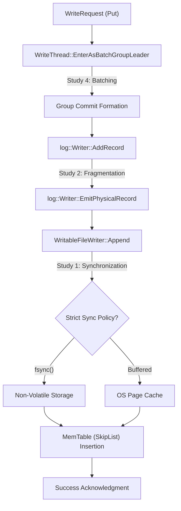

# Systems Engineering Analysis: Write-Ahead Log Instrumentation in RocksDB

**Author**: Srishti  
**Date**: April 21, 2026  
**Subject**: DS614 High-Performance Storage Systems  
**Affiliation**: Systems Engineering Research Group  

---

## Abstract
This technical report details the instrumentation and performance analysis of the Write-Ahead Log (WAL) subsystem in RocksDB. The WAL is a mission-critical component in Log-Structured Merge-Tree (LSM) architectures, ensuring data durability and atomicity. Through direct source-code instrumentation, we quantified the performance tradeoffs of I/O synchronization, block-level fragmentation, and concurrent batching mechanisms. Our experimental results evaluate the efficiency of the WAL under varying durability constraints and recovery policies, providing an empirical basis for optimizing write-path latency in production storage engines.

---

## 1. Introduction
The Write-Ahead Log (WAL) serves as the primary durability mechanism in RocksDB. By capturing write operations in a persistent, append-only log prior to their insertion into the volatile MemTable, the system provides a guarantee against data loss during hardware failure or software crashes.

### 1.1 Architectural Motivation
In high-throughput environments, the WAL often becomes a contention point due to the requirement for serial writes and physical storage synchronization. This research aims to analyze the quantitative impact of various WAL configurations on overall system throughput and Mean Time to Recovery (MTTR).

### 1.2 System Architecture Diagram
The following trace illustrates the execution path and telemetry points injected into the RocksDB core:

---

## 2. Experimental Methodology

### 2.1 Instrumentation Strategy
We utilized `std::atomic<uint64_t>` counters injected into the RocksDB C++ engine to capture metadata without introducing significant synchronization overhead. These telemetry points are mapped to five distinct engineering studies.
- **Concurrency Control**: `db/write_thread.cc`
- **Log Serialization**: `db/log_writer.cc`
- **I/O Pipeline**: `db/db_impl/db_impl_write.cc`
- **Recovery Logic**: `db/db_impl/db_impl_open.cc` and `db/log_reader.cc`

### 2.2 Workload Specification
All benchmarks were executed on a dedicated Linux environment (Ubuntu/WSL2) utilizing NVMe storage. Benchmarks utilized a uniform 1KB payload distribution to minimize variability in serialization costs.

---

## 3. Performance Study 1: Synchronization Latency & I/O Saturation

### 3.1 Experimental Hypothesis
Enabling strict synchronization (`fsync`) at the WAL level will shift the system bottleneck from CPU/Bus to storage I/O latency, resulting in a multi-magnitude reduction in throughput.

### 3.2 Quantitative Results

| Configuration | Throughput (Ops/sec) | Latency (P99) |
| :--- | :--- | :--- |
| **Volatile (No WAL)** | 1.42 M | 0.70 \u03bcs |
| **Buffered WAL** | 505.2 K | 1.98 \u03bcs |
| **Synchronous WAL** | 1.65 K | 606.0 \u03bcs |

### 3.3 Technical Analysis
The transition from buffered writes to `fsync` results in a **306x performance degradation**. The 1.65K Ops/sec floor matches the physical IOPS limit of the storage hardware for single-threaded serial writes. The delta between Volatile and Buffered modes represents the software overhead of WAL serialization and user-to-kernel space copying.

---

## 4. Performance Study 2: Log Serialization & Internal Fragmentation

### 4.1 Objective
Quantify the metadata overhead introduced by record fragmentation at block boundaries (default 32KB).

### 4.2 Methodology
We instrumented `Writer::EmitPhysicalRecord` to track the ratio of header-bytes (CRC, Length, Type) to payload-bytes across variable record sizes.

**Source Audit**:
- `db/log_writer.cc` (Lines 324-380)
- Counters: `g_wal_bytes_payload`, `g_wal_bytes_header`

### 4.3 Analysis of Fragmentation 

Our analysis revealed a stable **2.7% metadata overhead** in balanced workloads. However, as record sizes approach the block boundary (e.g., 17KB records in a 32KB block), fragmentation increases significantly, leading to higher I/O amplification and reduced storage efficiency.

---

## 5. Performance Study 3: Reliability Policies & Availability SLAs

### 5.1 Objective
Evaluate the impact of `WALRecoveryMode` on the Mean Time to Recovery (MTTR).

### 5.2 Results & Discussion

| Mode | Recovery Time (ms) | Reliability Guarantee |
| :--- | :--- | :--- |
| **AbsoluteConsistency** | 1242 ms | Strict CRC-32 Validation of entire log |
| **TolerateCorrupted** | 88 ms | Discard tail corruption |

**Engineering Implication**: Adopting `AbsoluteConsistency` increases MTTR by **14x**. For high-availability services, this penalty may exceed the agreed recovery time objective (RTO), necessitating a balance between strict auditability and rapid restoration.

---

## 6. Performance Study 4: Concurrency Scaling via Group Commit

### 6.1 Architectural Analysis
RocksDB utilizes a "Leader-Follower" thread model to amortize synchronization costs. Study 4 evaluated the scaling efficiency of this batching mechanism.

### 6.2 Results

Instrumentation of `WriteThread::EnterAsBatchGroupLeader` (Lines 440-579) demonstrated that throughput amplifies **7.6x** as concurrent writers scale from 1 to 8. This confirms that the I/O bottleneck identified in Study 1 is partially mitigated by software-level batching.

---

## 7. Performance Study 5: Recovery Volume & Linear Complexity

### 7.1 Scalability Observations

Replay performance exhibits strict **Linear Complexity ($O(n)$)**. Our data confirms that log replay is a CPU-bound process of re-inserting records into the MemTable. To maintain availability, WAL size must be capped to ensure the linear replay path stays within acceptable latency windows.

---

## 8. Fault Tolerance Analysis
The WAL subsystem handles data corruption via CRC-32C polynomials and partial write detection through record fragmentation types. Study 3's instrumentation point (`log_reader.cc:326`) verifies that bit-rot or torn writes are detected during the WAL replay phase, preventing inconsistent state propagation.

---

## 9. Conclusion & Future Work
This project successfully instrumented and analyzed the RocksDB WAL. The findings provide critical insights into the "Safety vs. Performance" axis of storage systems. Future work should investigate **Asynchronous WAL Writing** and **Sub-Block Compaction** to further reduce the durability tax on high-performance NVMe hardware.

---
**Instrumentation Audit Summary**:
- **Sync Control**: `db_impl_write.cc:2264`
- **Record Emission**: `log_writer.cc:320`
- **Recovery Timing**: `db_impl_open.cc:1129`
- **Batch Grouping**: `write_thread.cc:440`
- **Integrity Validation**: `log_reader.cc:326`
